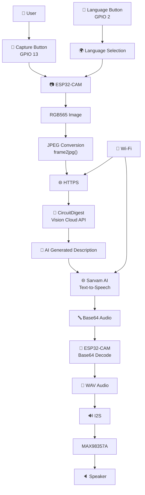
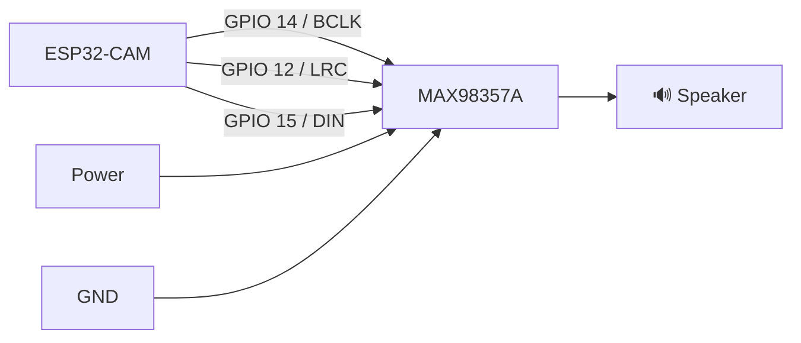

# 👁️ ESP32-CAM Multi-Language AI Vision Assistant

<p align="center">

**AI-powered visual assistance for real-time obstacle awareness and multilingual voice feedback**

<br>


</p>

---

## 📌 Overview

The **ESP32-CAM Multi-Language AI Vision Assistant** is an embedded AI system designed to provide spoken descriptions of obstacles and surroundings.

The device uses an **ESP32-CAM** to capture an image, sends the image to a cloud-based Vision AI service for analysis, and converts the resulting description into speech using **Sarvam AI Text-to-Speech**.

The spoken response is played through a **MAX98357A I2S audio amplifier and speaker**.

The system currently supports:

* 🇬🇧 English
* 🇮🇳 Hindi
* 🇮🇳 Tamil
* 🇮🇳 Malayalam

The firmware uses RGB565 camera capture and software JPEG conversion before transmitting the image to the Vision API.

---

## ✨ Key Features

| Feature                 | Description                                       |
| ----------------------- | ------------------------------------------------- |
| 📷 AI Vision            | Captures images and sends them for AI analysis    |
| 🤖 Cloud AI             | Uses CircuitDigest Vision Cloud                   |
| 🗣️ Multilingual TTS    | Generates spoken responses using Sarvam AI        |
| 🌍 4 Languages          | English, Hindi, Tamil and Malayalam               |
| 🔊 I2S Audio            | MAX98357A digital audio output                    |
| ⚡ Dynamic Bus Switching | Camera and I2S resources are dynamically managed  |
| 💾 PSRAM Support        | Uses PSRAM for large audio buffers when available |
| 📊 Performance Metrics  | Measures individual processing stages             |
| 🔘 Physical Controls    | Dedicated capture and language buttons            |
| 💡 Flash Assistance     | Camera flash activates during image capture       |
| 🔐 HTTPS                | Secure cloud communication                        |

---

# 🎯 Project Objective

The objective is to create a compact embedded vision assistant capable of:

```text
Capture surroundings
       ↓
Understand the scene
       ↓
Identify obstacles / path condition
       ↓
Generate a short description
       ↓
Convert description to speech
       ↓
Play the result to the user
```

The AI prompt is specifically designed to produce concise information about obstacles directly ahead and whether the path is clear or blocked.

---

# 🏗️ System Architecture



---

# 🔄 Processing Pipeline

The complete processing sequence is:

```text
┌──────────────────────┐
│     CAPTURE IMAGE    │
└──────────┬───────────┘
           ↓
┌──────────────────────┐
│   RGB565 FRAME       │
└──────────┬───────────┘
           ↓
┌──────────────────────┐
│ RGB565 → JPEG        │
│ Software Conversion  │
└──────────┬───────────┘
           ↓
┌──────────────────────┐
│ CIRCUITDIGEST        │
│ VISION AI            │
└──────────┬───────────┘
           ↓
┌──────────────────────┐
│ GENERATED TEXT       │
└──────────┬───────────┘
           ↓
┌──────────────────────┐
│ SARVAM AI TTS        │
└──────────┬───────────┘
           ↓
┌──────────────────────┐
│ BASE64 WAV AUDIO     │
└──────────┬───────────┘
           ↓
┌──────────────────────┐
│ BASE64 DECODE        │
└──────────┬───────────┘
           ↓
┌──────────────────────┐
│ I2S → MAX98357A      │
└──────────┬───────────┘
           ↓
┌──────────────────────┐
│      SPEAKER         │
└──────────────────────┘
```

---

Then add them to this section.

### 🔧 Hardware Prototype

<p align="center">
  
</p>

*ESP32-CAM, MAX98357A amplifier, speaker and control buttons.*

---

### 📷 ESP32-CAM Assembly

<p align="center">
  
</p>

*ESP32-CAM vision capture unit.*

---

### 🖥️ Serial Monitor

<p align="center">
  
</p>

*Real-time system status and performance benchmark output.*

---

### 🤖 AI Vision Result

<p align="center">
  
</p>

*AI-generated description returned from the vision service.*

---

> **Note:** The image paths above are placeholders. Replace them with your actual project photographs and screenshots.

---

# 🔌 Wiring Diagram

## ESP32-CAM → Control Buttons

| Component             | ESP32-CAM |
| --------------------- | --------: |
| Capture Button        |   GPIO 13 |
| Language Button       |    GPIO 2 |
| Button other terminal |       GND |

The firmware configures both buttons using internal pull-up resistors.

### Button Logic

```text
GPIO 13 ──────┐
              │
          [ CAPTURE ]
              │
             GND


GPIO 2 ───────┐
              │
         [ LANGUAGE ]
              │
             GND
```

A button press pulls the GPIO LOW.

---

# 🔊 ESP32-CAM → MAX98357A

The I2S interface is configured as:

| MAX98357A   |          ESP32-CAM |
| ----------- | -----------------: |
| BCLK        |            GPIO 14 |
| LRC / WS    |            GPIO 12 |
| DIN         |            GPIO 15 |
| GND         |                GND |
| VIN         | Appropriate supply |
| OUT+ / OUT- |            Speaker |

The firmware defines:

```cpp
#define I2S_BCLK 14
#define I2S_LRC  12
#define I2S_DOUT 15
```

and initializes the I2S interface dynamically before audio playback.

---

## 🔌 Audio Wiring Diagram



> **Important:** Verify the supply voltage and speaker impedance requirements of your specific MAX98357A module before powering the circuit.

---

# 📷 Camera Interface

The firmware uses the following camera GPIO configuration:

| Camera Signal | GPIO |
| ------------- | ---: |
| PWDN          |   32 |
| RESET         |   -1 |
| XCLK          |    0 |
| SIOD          |   26 |
| SIOC          |   27 |
| Y9            |   35 |
| Y8            |   34 |
| Y7            |   39 |
| Y6            |   36 |
| Y5            |   21 |
| Y4            |   19 |
| Y3            |   18 |
| Y2            |    5 |
| VSYNC         |   25 |
| HREF          |   23 |
| PCLK          |   22 |

The firmware configures the camera for QVGA RGB565 capture.

---

# ⚠️ Important GPIO Architecture

This project uses GPIO resources that overlap between the camera and I2S audio configuration.

To handle this, the firmware uses **dynamic bus switching**.

### Camera mode

```text
I2S STOPPED
     ↓
Camera initialized
     ↓
Image captured
     ↓
JPEG generated
     ↓
Camera deinitialized
```

### Audio mode

```text
Camera STOPPED
     ↓
I2S initialized
     ↓
WAV decoded
     ↓
Audio played
     ↓
I2S stopped
```

This behavior is implemented through `initI2S()`, `stopI2S()`, and `initCameraHardware()`.

---

# 🌍 Supported Languages

| Language       | Language Code | Sarvam Voice |
| -------------- | ------------- | ------------ |
| 🇮🇳 Hindi     | `hi-IN`       | `shubh`      |
| 🇬🇧 English   | `en-IN`       | `shubh`      |
| 🇮🇳 Tamil     | `ta-IN`       | `kavitha`    |
| 🇮🇳 Malayalam | `ml-IN`       | `gokul`      |

The firmware stores these settings in a `LanguageConfig` structure.

---

# 🔘 User Interface

## Capture Button

**GPIO 13**

Press once to:

```text
Capture → Analyze → Speak
```

The firmware applies a 500 ms button debounce interval.

---

## 🌐 Language Button

**GPIO 2**

Each press cycles through the four supported languages.

```text
Hindi
  ↓
English
  ↓
Tamil
  ↓
Malayalam
  ↓
Hindi
```

The device announces the selected language using TTS.

---

# 🔑 API Configuration

The project uses two cloud APIs.

| Service                    | Purpose                | Endpoint / Configuration                                        |
| -------------------------- | ---------------------- | --------------------------------------------------------------- |
| CircuitDigest Vision Cloud | Image → AI description | `https://www.circuitdigest.cloud/api/v1/image-to-text/generate` |
| Sarvam AI                  | Text → Speech          | `https://api.sarvam.ai/text-to-speech`                          |

---

## 1️⃣ CircuitDigest Vision API

The firmware stores the Vision API key in:

```cpp
const char* visionApiKey = "YOUR_CIRCUITDIGEST_API_KEY";
```

The image request contains:

```text
prompt
imageFile
```

The image is uploaded as:

```text
multipart/form-data
```

The firmware sends the API key using the `X-API-Key` HTTP header.

### API Flow

```text
ESP32-CAM
    │
    │ JPEG + Prompt
    ▼
CircuitDigest Vision API
    │
    │ JSON
    ▼
generated_text
```

---

# 2️⃣ Sarvam AI Text-to-Speech

The Sarvam API key is configured as:

```cpp
const char* sarvamKey = "YOUR_SARVAM_API_KEY";
```

The current API request uses:

```text
Model: bulbul:v3
Sample Rate: 16000 Hz
Pace: 0.90
```

The firmware sends the selected language code and voice model in the request.

### API Flow

```text
AI Description
      │
      ▼
Sarvam TTS
      │
      ▼
Base64 Audio
      │
      ▼
ESP32 Decode
      │
      ▼
WAV
      │
      ▼
I2S
```

---

# 🔐 API Security

**Never commit real credentials to GitHub.**

Use placeholders in your public source code:

```cpp
const char* ssid        = "YOUR_WIFI_SSID";
const char* password    = "YOUR_WIFI_PASSWORD";

const char* visionApiKey = "YOUR_CIRCUITDIGEST_API_KEY";
const char* sarvamKey    = "YOUR_SARVAM_API_KEY";
```

The uploaded source currently contains credential placeholders, which should remain placeholders in the public repository.

For a production implementation, credentials should preferably be separated from the main source code.

---

# 📦 Required Libraries

The firmware uses:

```cpp
#include "esp_camera.h"
#include "img_converters.h"
#include <WiFi.h>
#include <WiFiClientSecure.h>
#include <HTTPClient.h>
#include <ArduinoJson.h>
#include "driver/i2s.h"
#include "mbedtls/base64.h"
```

### Dependencies

* ESP32 Arduino Core
* ArduinoJson
* ESP32 Camera Driver
* ESP32 I2S Driver
* mbedTLS Base64

---

# 💻 Software Requirements

Recommended development environment:

| Software           | Purpose              |
| ------------------ | -------------------- |
| Arduino IDE        | Firmware development |
| ESP32 Arduino Core | ESP32 support        |
| ArduinoJson        | JSON parsing         |
| CircuitDigest API  | Vision analysis      |
| Sarvam AI          | Text-to-speech       |

---

# 🚀 Installation

## Step 1 — Clone the Repository

```bash
git clone https://github.com/YOUR_USERNAME/ESP32-CAM-Multi-Language-Vision-Assistant.git
```

```bash
cd ESP32-CAM-Multi-Language-Vision-Assistant
```

---

## Step 2 — Open in Arduino IDE

Open:

```text
ESP32-CAM-Multi-Language-Vision-Assistant.ino
```

---

## Step 3 — Configure Wi-Fi

Change:

```cpp
const char* ssid     = "YOUR_WIFI_SSID";
const char* password = "YOUR_WIFI_PASSWORD";
```

---

## Step 4 — Configure APIs

Add your API credentials:

```cpp
const char* visionApiKey = "YOUR_CIRCUITDIGEST_API_KEY";
const char* sarvamKey    = "YOUR_SARVAM_API_KEY";
```

---

## Step 5 — Select Board

Select the ESP32-CAM board corresponding to your hardware.

Then select the correct COM port.

---

## Step 6 — Compile and Upload

Compile the firmware and upload it to the ESP32-CAM.

After uploading, open Serial Monitor at:

```text
115200 baud
```

---

# 🧪 Startup Sequence

After booting, the firmware:

```text
1. Disables brownout detection
2. Starts Serial
3. Configures buttons
4. Configures flash LED
5. Connects to Wi-Fi
6. Announces Wi-Fi connection
7. Announces current language
8. Waits for user input
```

The startup configuration is implemented in `setup()`.

---

# 📊 Performance Monitoring

One of the project's useful features is its built-in timing benchmark.

The firmware measures:

```text
Camera initialization
Image capture
JPEG conversion
Camera deinitialization
Vision SSL connection
Image upload
Vision AI response
JSON parsing
Sarvam SSL connection
Sarvam POST request
Audio download
Base64 extraction
Base64 decoding
Speaker playback
Total end-to-end delay
```

The measurements are printed to the Serial Monitor after a successful AI response.

---

# ⚙️ Audio Configuration

Current configuration:

```cpp
const float AUDIO_GAIN_FACTOR = 2.5f;
const float speechPace = 0.90;
```

Audio is requested at:

```text
16,000 Hz
16-bit
```

The firmware supports both mono and stereo WAV processing and duplicates mono samples across left/right I2S channels.

---

# 🧠 Memory Management

The project defines:

```cpp
#define BOARD_HAS_PSRAM
```

Audio buffers are preferentially allocated in PSRAM:

```text
PSRAM
  ↓
If unavailable
  ↓
Standard heap
```

This is useful because Base64-encoded audio can require a significant temporary memory buffer.

---

# 🛠️ Troubleshooting

### Camera initialization failure

Check:

* Camera ribbon cable
* Camera module
* ESP32-CAM board selection
* Camera GPIO configuration
* Power supply

Serial output:

```text
[CAMERA ERROR] Failed hardware initialization!
```

---

### Vision API connection failure

Check:

* Wi-Fi connection
* Internet connection
* API key
* CircuitDigest API availability

Serial output:

```text
[CLOUD ERROR] Could not connect to Vision Cloud!
```

---

### Vision response timeout

The firmware waits up to approximately 10 seconds for the API response.

Check:

* Wi-Fi signal strength
* Internet latency
* API availability
* Request size

---

### No speaker output

Check:

* MAX98357A wiring
* Speaker wiring
* I2S pins
* Power
* Sarvam API key
* API response

---

### Distorted audio

Reduce:

```cpp
AUDIO_GAIN_FACTOR
```

For example:

```cpp
const float AUDIO_GAIN_FACTOR = 1.5f;
```

# 👨‍💻 Author

## P-TECH

**ESP32-CAM Multi-Language AI Vision Assistant**

Built with:

```text
ESP32-CAM
     +
Computer Vision
     +
Cloud AI
     +
Sarvam AI
     +
I2S Audio
     +
Embedded Systems
```

---

# ⭐ Project Highlights

<p align="center">

| 📷 Vision |     🤖 AI    |  🗣️ Voice | 🌍 Languages |
| :-------: | :----------: | :--------: | :----------: |
| ESP32-CAM | Cloud Vision | Sarvam TTS |       4      |

</p>

---

## 📜 Project Workflow

```text
                    ┌──────────────────┐
                    │      START       │
                    └────────┬─────────┘
                             │
                             ▼
                    ┌──────────────────┐
                    │ Connect to Wi-Fi │
                    └────────┬─────────┘
                             │
                             ▼
                    ┌──────────────────┐
                    │ Select Language  │
                    └────────┬─────────┘
                             │
                             ▼
                    ┌──────────────────┐
                    │ Capture Button   │
                    └────────┬─────────┘
                             │
                             ▼
                    ┌──────────────────┐
                    │ Capture RGB565   │
                    │ Image            │
                    └────────┬─────────┘
                             │
                             ▼
                    ┌──────────────────┐
                    │ Convert to JPEG  │
                    └────────┬─────────┘
                             │
                             ▼
                    ┌──────────────────┐
                    │ CircuitDigest    │
                    │ Vision AI        │
                    └────────┬─────────┘
                             │
                             ▼
                    ┌──────────────────┐
                    │ AI Description   │
                    └────────┬─────────┘
                             │
                             ▼
                    ┌──────────────────┐
                    │ Sarvam AI TTS    │
                    └────────┬─────────┘
                             │
                             ▼
                    ┌──────────────────┐
                    │ Decode Base64    │
                    │ WAV Audio        │
                    └────────┬─────────┘
                             │
                             ▼
                    ┌──────────────────┐
                    │ MAX98357A / I2S  │
                    └────────┬─────────┘
                             │
                             ▼
                    ┌──────────────────┐
                    │     SPEAKER      │
                    └────────┬─────────┘
                             │
                             ▼
                    ┌──────────────────┐
                    │       END        │
                    └──────────────────┘
```

---

<p align="center">

### 👁️ See the World. Understand It. Hear the Answer.

**ESP32-CAM × Vision AI × Sarvam AI**

</p>
