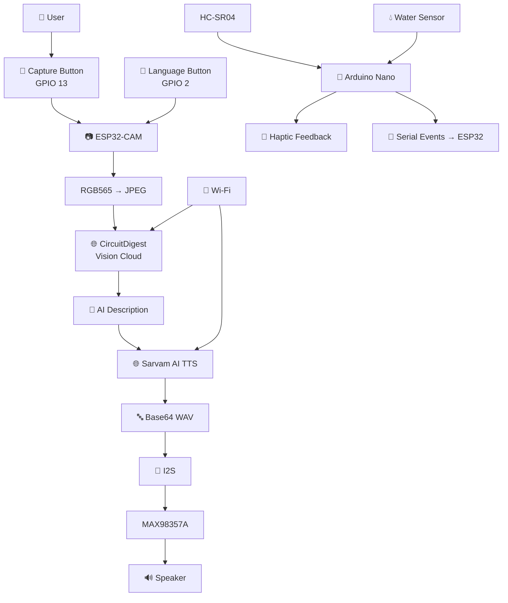

# 👁️ ESP32-CAM Multi-Language AI Vision Assistant

<p align="center">

**AI-powered visual assistance for real-time obstacle awareness and multilingual voice feedback**

<br><br>


</p>

---

## 📌 Overview

The **ESP32-CAM Multi-Language AI Vision Assistant** is an embedded accessibility system that combines camera-based AI scene understanding with multilingual spoken feedback.

The ESP32-CAM captures an image, converts the RGB565 frame to JPEG, sends it to **CircuitDigest Vision Cloud**, and converts the resulting description to speech using **Sarvam AI Text-to-Speech**. Audio is played through a **MAX98357A I2S amplifier and speaker**.

The repository also contains an **Arduino Nano smart walking-stick sensor node** for local obstacle and water detection with haptic feedback.

### Supported languages

- 🇬🇧 English — `en-IN`
- 🇮🇳 Hindi — `hi-IN`
- 🇮🇳 Tamil — `ta-IN`
- 🇮🇳 Malayalam — `ml-IN`

---

## ✨ Key Features

| Feature | Description |
|---|---|
| 📷 AI Vision | Image capture and cloud-based scene analysis |
| 🤖 CircuitDigest Vision | Image → concise AI description |
| 🗣️ Sarvam AI TTS | AI description → spoken audio |
| 🌍 Multilingual | English, Hindi, Tamil and Malayalam |
| 🔊 I2S Audio | MAX98357A digital audio output |
| ⚡ Dynamic Bus Switching | Camera and I2S resources are managed dynamically |
| 💾 PSRAM Support | Large audio buffers can use PSRAM |
| 📊 Performance Metrics | Processing-stage timing through Serial Monitor |
| 🔘 Physical Controls | Capture and language buttons |
| 💡 Flash Assistance | Camera flash during capture |
| 🦯 Walking Stick Node | Local ultrasonic + water sensing with haptic feedback |
| 🔐 HTTPS | Secure cloud communication |

---

# 🏗️ System Architecture


```mermaid
flowchart TD
    U["👤 User"] --> C["🔘 Capture Button<br/>GPIO 13"]
    C --> CAM["📷 ESP32-CAM"]
    CAM --> JPG["RGB565 → JPEG"]
    JPG --> V["🌐 CircuitDigest<br/>Vision Cloud"]
    V --> T["📝 AI Description"]
    T --> S["🌐 Sarvam AI TTS"]
    S --> A["🔤 Base64 WAV"]
    A --> I["🎵 I2S"]
    I --> AMP["MAX98357A"]
    AMP --> SPK["🔊 Speaker"]
    L["🔘 Language Button<br/>GPIO 2"] --> CAM
    W["📡 Wi-Fi"] --> V
    W --> S

    N["🦯 Arduino Nano"] --> H["📳 Haptic Feedback"]
    US["HC-SR04"] --> N
    WS["💧 Water Sensor"] --> N
    N --> E["📡 Serial Events → ESP32"]
```

---

# 🔄 Vision Processing Pipeline

```text
CAPTURE IMAGE
      ↓
RGB565 FRAME
      ↓
RGB565 → JPEG
      ↓
CircuitDigest Vision AI
      ↓
AI Generated Description
      ↓
Sarvam AI TTS
      ↓
Base64 WAV Audio
      ↓
ESP32 Decode
      ↓
I2S → MAX98357A
      ↓
SPEAKER
```

---

# 🦯 Arduino Nano Smart Walking Stick Sensor Node

Firmware: **[`smart_walking_stick_nano_v1.ino`](smart_walking_stick_nano_v1.ino)**

The Nano provides a lightweight local safety layer for the smart walking-stick subsystem. It monitors distance and water conditions and drives a vibration motor without blocking the main sensor loop.

## Pin Configuration

| Component | Nano Pin | Function |
|---|---:|---|
| HC-SR04 TRIG | D9 | Ultrasonic trigger |
| HC-SR04 ECHO | D10 | Ultrasonic echo |
| Water sensor | A2 | Analog water detection |
| Vibration motor | D6 | PWM haptic output |
| SoftwareSerial RX | D2 | Serial input |
| SoftwareSerial TX | D3 | Serial output |
| Serial | 9600 baud | Nano ↔ ESP32 communication |

## Haptic Safety Logic

| Condition | Response |
|---|---|
| `< 30 cm` obstacle | Maximum / continuous danger vibration |
| `30–100 cm` obstacle | Distance-dependent vibration |
| No obstacle | No obstacle alert |
| Water detected | `SHORT → SHORT → LONG → PAUSE` |

A close obstacle has priority over the water pattern. The water pattern uses `millis()` rather than blocking delays so sensor monitoring and serial communication continue during the alert.

## Serial Event Protocol

```text
WATER
OBSTACLE:<distance_cm>
CLEAR
```

Example:

```text
OBSTACLE:27
```

### ⚠️ Logic-Level Warning

The classic Arduino Nano uses **5 V logic**, while ESP32 GPIOs are **3.3 V logic**. Do **not** connect Nano TX directly to an ESP32 RX input. Use a suitable level shifter or resistor divider.

---

# 🔌 ESP32-CAM Wiring

## Control Buttons

| Component | ESP32-CAM |
|---|---:|
| Capture button | GPIO 13 |
| Language button | GPIO 2 |
| Other button terminal | GND |

Both inputs use internal pull-ups; pressing a button pulls the GPIO LOW.

## MAX98357A I2S

| MAX98357A | ESP32-CAM |
|---|---:|
| BCLK | GPIO 14 |
| LRC / WS | GPIO 12 |
| DIN | GPIO 15 |
| GND | GND |
| VIN | Appropriate supply |
| OUT+ / OUT- | Speaker |

```cpp
#define I2S_BCLK 14
#define I2S_LRC  12
#define I2S_DOUT 15
```

> **Important:** Verify the supply voltage and speaker impedance requirements of your specific MAX98357A module before powering the circuit.

---

# 📷 Camera Interface

| Camera Signal | GPIO |
|---|---:|
| PWDN | 32 |
| RESET | -1 |
| XCLK | 0 |
| SIOD | 26 |
| SIOC | 27 |
| Y9 | 35 |
| Y8 | 34 |
| Y7 | 39 |
| Y6 | 36 |
| Y5 | 21 |
| Y4 | 19 |
| Y3 | 18 |
| Y2 | 5 |
| VSYNC | 25 |
| HREF | 23 |
| PCLK | 22 |

The firmware uses QVGA RGB565 capture followed by software JPEG conversion.

---

# ⚠️ Dynamic GPIO / Bus Switching

Camera and I2S resources overlap on the ESP32-CAM design, so the firmware switches between the two operating modes.

```text
CAMERA MODE
I2S stopped
    ↓
Camera initialized
    ↓
Image captured
    ↓
JPEG generated
    ↓
Camera deinitialized

AUDIO MODE
Camera stopped
    ↓
I2S initialized
    ↓
WAV decoded
    ↓
Audio played
    ↓
I2S stopped
```

The implementation uses `initCameraHardware()`, `initI2S()` and `stopI2S()`.

---

# 🌍 Language Configuration

| Language | Code | Voice |
|---|---|---|
| Hindi | `hi-IN` | `shubh` |
| English | `en-IN` | `shubh` |
| Tamil | `ta-IN` | `kavitha` |
| Malayalam | `ml-IN` | `gokul` |

The language button on **GPIO 2** cycles through the supported languages. The capture button on **GPIO 13** starts the `Capture → Analyze → Speak` workflow.

---

# 🔑 API Configuration

| Service | Purpose | Endpoint |
|---|---|---|
| CircuitDigest Vision Cloud | Image → AI description | `https://www.circuitdigest.cloud/api/v1/image-to-text/generate` |
| Sarvam AI | Text → speech | `https://api.sarvam.ai/text-to-speech` |

### CircuitDigest

```cpp
const char* visionApiKey = "YOUR_CIRCUITDIGEST_API_KEY";
```

The image is uploaded as `multipart/form-data` with the API key supplied through the `X-API-Key` header.

### Sarvam AI

```cpp
const char* sarvamKey = "YOUR_SARVAM_API_KEY";
```

Current audio configuration documented by the firmware:

```text
Model: bulbul:v3
Sample Rate: 16000 Hz
Pace: 0.90
```

---

# 🔐 Security

**Never commit real Wi-Fi or API credentials to GitHub.** Use placeholders:

```cpp
const char* ssid        = "YOUR_WIFI_SSID";
const char* password    = "YOUR_WIFI_PASSWORD";
const char* visionApiKey = "YOUR_CIRCUITDIGEST_API_KEY";
const char* sarvamKey    = "YOUR_SARVAM_API_KEY";
```

For production hardware, credentials should preferably be separated from the main firmware source.

---

# 📦 Required Libraries

ESP32 firmware dependencies include:

```cpp
#include "esp_camera.h"
#include "img_converters.h"
#include <WiFi.h>
#include <WiFiClientSecure.h>
#include <HTTPClient.h>
#include <ArduinoJson.h>
#include "driver/i2s.h"
#include "mbedtls/base64.h"
```

Required environment:

- Arduino IDE
- ESP32 Arduino Core
- ArduinoJson
- ESP32 camera driver
- ESP32 I2S driver
- mbedTLS Base64

---

# 🚀 Installation

```bash
git clone https://github.com/ptech8000/Smart_Vision_Analyst_ESP32_CAM.git
cd Smart_Vision_Analyst_ESP32_CAM
```

1. Open the ESP32-CAM firmware in Arduino IDE.
2. Configure Wi-Fi credentials.
3. Configure CircuitDigest and Sarvam API keys.
4. Select the ESP32-CAM board matching your hardware.
5. Select the correct COM port.
6. Compile and upload.
7. Open Serial Monitor at **115200 baud**.

The Nano sensor firmware can be opened separately as `smart_walking_stick_nano_v1.ino` and uploaded to the Arduino Nano.

---

# 🧪 Startup & Performance Monitoring

The ESP32-CAM firmware initializes Serial, buttons, flash, Wi-Fi and language selection before waiting for user input.

The Serial Monitor reports timing for stages including:

```text
Camera initialization
Image capture
JPEG conversion
Camera deinitialization
Vision SSL connection
Image upload
Vision response
JSON parsing
Sarvam request
Audio download
Base64 extraction / decoding
Speaker playback
Total end-to-end delay
```

Audio uses 16 kHz / 16-bit processing and can use PSRAM for large temporary buffers when available.

---

# 🖼️ Project Images

> Replace the following placeholder paths with the actual project photographs/screenshots when available.

### Hardware Prototype


### ESP32-CAM Assembly


### Serial Monitor


### AI Vision Result


---

# 🧩 Repository Structure

```text
Smart_Vision_Analyst_ESP32_CAM/
│
├── README.md
├── smart_walking_stick_nano_v1.ino
│
└── images/
    ├── hardware-setup.jpg
    ├── esp32cam-device.jpg
    ├── serial-monitor.jpg
    └── ai-result.jpg
```

### System relationship

```text
                 SMART ASSISTANCE SYSTEM
                          │
          ┌───────────────┴───────────────┐
          │                               │
          ▼                               ▼
  📷 ESP32-CAM VISION              🦯 ARDUINO NANO
          │                               │
    Cloud Vision AI                 Local Sensors
          │                               │
    Sarvam AI TTS                  Haptic Feedback
          │                               │
          └───────────────┬───────────────┘
                          ▼
                User Safety Assistance
```

---

# 🛠️ Troubleshooting

### Camera initialization failure

Check the camera ribbon cable, camera module, board selection, GPIO configuration and power supply.

### Vision API failure

Check Wi-Fi, Internet connectivity, API key and CircuitDigest availability.

### No speaker output

Check MAX98357A wiring, speaker wiring, I2S pins, power and Sarvam API credentials.

### Distorted audio

Reduce the firmware's `AUDIO_GAIN_FACTOR`, for example:

```cpp
const float AUDIO_GAIN_FACTOR = 1.5f;
```

---

# 👨‍💻 Author

## P-TECH

**Precision Technology, Engineering & Creative Hardware**

Built with:

```text
ESP32-CAM
   +
Computer Vision
   +
Cloud AI
   +
Sarvam AI
   +
Arduino Nano
   +
Haptic Feedback
   +
I2S Audio
   +
Embedded Systems
```

---

# ⭐ Project Highlights

| 📷 Vision | 🤖 AI | 🗣️ Voice | 🦯 Haptics |
|:---:|:---:|:---:|:---:|
| ESP32-CAM | Cloud Vision | Sarvam TTS | Arduino Nano |

---

<p align="center">

### 👁️ See the World. Understand It. Hear the Answer.

**ESP32-CAM × Vision AI × Sarvam AI × Smart Haptic Sensing**

</p>
